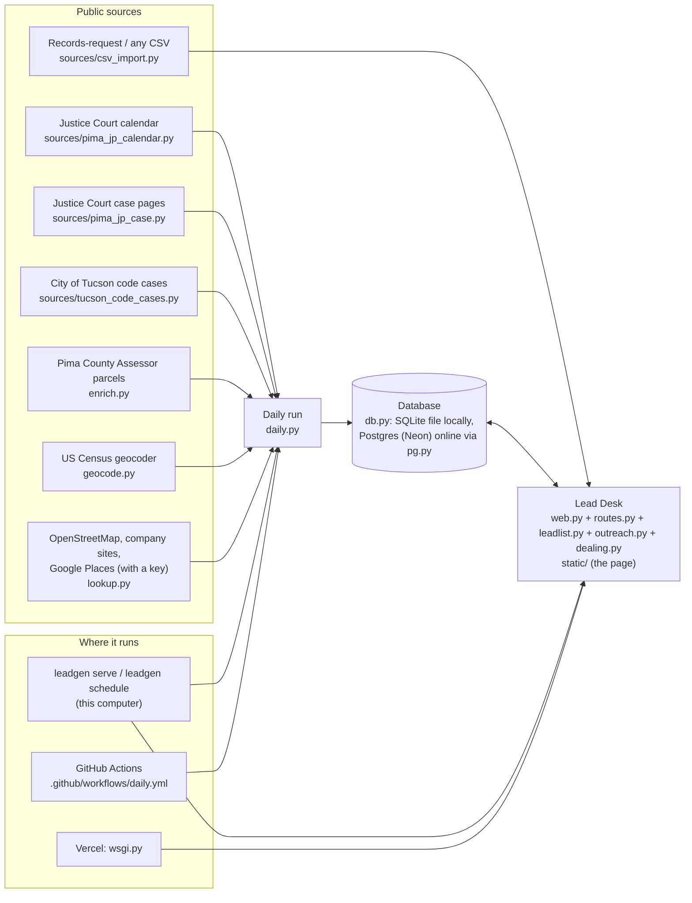

# How Lead Desk fits together

For developers. What Lead Desk does for its user is in [OPERATOR.md](OPERATOR.md),
the commands are in [COMMANDS.md](COMMANDS.md), and where the data comes from
(and the legal limits on using it) is in [DATA_SOURCES.md](DATA_SOURCES.md).

## Data flow



- **Locally:** `leadgen serve` (web.py, routes.py) serves the page and the
  JSON API and runs the daily check in a background thread (jobs.py).
  `leadgen schedule install` (schedule.py) runs `leadgen daily` every morning.
- **Online:** Vercel runs `leadgen/wsgi.py` (the same `handle` as locally,
  behind a password) against Neon Postgres. Vercel keeps no files and no
  long-running threads, so **the daily check runs on GitHub Actions in
  `.github/workflows/daily.yml`**, writing to the same database. "Check for
  new evictions" online starts that workflow (`LEADDESK_GITHUB_TOKEN`).
  Setup: [VERCEL.md](VERCEL.md).

## Modules

| Module | Role |
|---|---|
| `leadgen/sources/pima_jp_calendar.py` | Searches the Justice Court calendar for eviction hearings (upcoming only) |
| `leadgen/sources/pima_jp_case.py` | **Reads Justice Court case pages**: parties, eviction notice, judgment, writ, case stage (`case_stage`), next court date; adds cases by pasted link (`add_cases`) and re-reads open ones (`update_cases`) |
| `leadgen/sources/tucson_code_cases.py` | City of Tucson code-enforcement cases (junk, debris, vacant buildings) |
| `leadgen/sources/csv_import.py` | Any CSV, including the court's records-request file (addresses, judgment and writ dates, disposition) |
| `leadgen/enrich.py` | Owner of record and parcel from the Pima County Assessor layer |
| `leadgen/geocode.py` | Census geocoder: coordinates, and whether an address is in Pima County |
| `leadgen/lookup.py` | The business phone lookup run (`find_contacts`): which providers, in what order, retries, one lookup per company |
| `leadgen/providers.py` | The lookup's providers: OpenStreetMap (Overpass near the property, Nominatim by name in the Tucson area), company websites, Google Places when a key is set; daily and monthly Google limits |
| `leadgen/business.py` | Which company names a lead's lookup searches for, and matching a found business to them |
| `leadgen/phonepass.py` | The first-phones pass (the landlords of the best eviction leads, ten at a time) and the automatic lookup's yield |
| `leadgen/contacts.py` | Skip-trace export and contact import |
| `leadgen/daily.py` | The daily run: each step in order, failures recorded, same-day retry |
| `leadgen/jobs.py` | Background jobs (Update court cases, Find landlord phones) and the daily schedule inside Lead Desk |
| `leadgen/db.py` | Schema, migrations (run once per database), upserts, rank triggers, settings, the kill switch watch |
| `leadgen/pg.py` | Gives Postgres the small `sqlite3` interface the code uses, translating the SQL |
| `leadgen/leadlist.py` | The list: views, filters, priority (stored rank columns kept fresh by triggers), paging in SQL, counts, address progress |
| `leadgen/outreach.py` | Outreach methods, scripts and settings; a lead's priority, stage, latest event and which methods can work it |
| `leadgen/dealing.py` | Assign leads: the balanced split across methods, landlords kept together, leads outside the split |
| `leadgen/results.py` | The Results tab: each method's funnel and cost, the mix of leads it got, whether they can be ranked yet |
| `leadgen/web.py` | `App`: everything the page can ask for (state, settings, Assign leads, imports, jobs) |
| `leadgen/edits.py` | `App`'s edits to one lead: fields, a landlord's number on its other leads, logged contacts |
| `leadgen/routes.py` | HTTP routes, static files, the local server |
| `leadgen/wsgi.py` | The WSGI app Vercel runs |
| `leadgen/forms.py` | Checks on what the page sends (money, counts, notes, settings) |
| `leadgen/export.py` | CSV and HTML exports |
| `leadgen/cli.py` | The `leadgen` command |
| `leadgen/static/` | The page: `core.js` (state, helpers), `leads.js`, `drawer.js` (one lead), `outreach.js`, `results.js`, `settings.js`, `app.css` |

## The lead list stays fast

Priority is stored on each lead (`stage_rank`, `base_points`, `rank_latest`,
`rank_score`, plus `rank_code`, `multi_home`, `lookup_name`). A trigger marks
a lead for re-ranking when any input changes (`derived_src`). The next
request re-ranks only those rows, plus the whole view once a day for
recency and for whether a judgment or writ is still recent (45 days). Filtering, ordering and paging then happen in SQL on indexes, and
only the 100 leads on screen are turned into page rows. Counts and summaries
are memoized in-process against a data-version counter that triggers bump
on every change to `leads` or `touches`. A page of 100 leads takes about the
same time at 10,000 and 20,000 leads (`tests/test_rank_sql.py`).

## Automated checks (GitHub Actions)

| Workflow | When | What |
|---|---|---|
| `ci.yml` | every push to main and every PR | ruff, mypy, pytest with a coverage floor on SQLite, the same tests on Postgres, browser tests, then counts-only live checks |
| `daily.yml` | 6:00 Tucson, retries 7-12, and on demand | The daily check against the Neon database |
| `live-court.yml` | daily | Fails if the court calendar shows no eviction hearings (page changed) |
| `live-contacts.yml` | daily | Fresh database, 20 landlords, free lookup only: fails if no eviction lead gets a phone or email |

The repository is public: every workflow prints counts only, and lead data
(`data/`, `exports/`, `*.db`, `*.csv`) is git-ignored. Test fixtures use
made-up names.

## De-duplication

Each upstream record (`source` + case number) is stored once and refreshed on
later runs. Addresses are normalized ("123 North Main Street Apt 4" and
"123 N MAIN ST #4" match), and when a second record lands on an address that's
already listed, it is linked to the first one and hidden from exports
(`--include-duplicates` shows it).

## Environment variables

| Variable | What it does | Default |
|---|---|---|
| `LEADGEN_DATA_DIR` | Folder for the local SQLite database | `data` |
| `LEADGEN_DB` | Path of the local SQLite database | `$LEADGEN_DATA_DIR/leads.db` |
| `DATABASE_URL` | Postgres (Neon) database; when set, used instead of the SQLite file | unset |
| `POSTGRES_URL` | Read when `DATABASE_URL` isn't set (some Vercel integrations name it this) | unset |
| `LEADDESK_PASSWORD` | Password for Lead Desk online (required there) | unset |
| `LEADDESK_PAUSED` | `1` pauses the daily check, case page reads, code case fetches and all lookups | unset (running) |
| `GOOGLE_PLACES_API_KEY` | Google Places key for phone lookups; overrides the key in Settings | unset |
| `LEADDESK_GITHUB_TOKEN` | Online, lets "Check for new evictions" start the GitHub Actions check | unset |
| `LEADDESK_GITHUB_REF` | Branch that check runs from | `main` |
| `VERCEL_GIT_REPO_OWNER`, `VERCEL_GIT_REPO_SLUG` | Set by Vercel; name the repository for that check | set by Vercel |
| `TEST_DATABASE_URL` | Tests only: run the suite against this Postgres database | unset (SQLite) |

## Tests

```sh
pytest                                  # Python tests (SQLite)
pytest --cov                            # with line coverage; fails below the floor in pyproject.toml
TEST_DATABASE_URL=postgresql://... pytest   # the same tests on Postgres
ruff check . && ruff format --check .   # lint and format
mypy                                    # type check
```

The browser tests (`tests/test_browser.py`) drive Lead Desk in headless
Chromium; they run when Playwright is installed
(`pip install -e ".[dev]" && python -m playwright install chromium`) and
are skipped otherwise, with the reason (such as the missing browser file).
In CI (where `CI` is set) a missing browser fails the run instead. CI runs
all of these, with coverage on the SQLite run.
